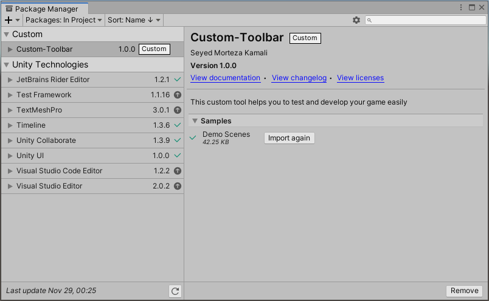

# CustomToolbar


based on this [marijnz unity-toolbar-extender](https://github.com/marijnz/unity-toolbar-extender). 


### Why you should use the CustomToolbar?
This custom tool helps you to test and develop your game easily

## Installation

You can also install via git url by adding this entry in your **manifest.json**

```"com.smkplus.custom-toolbar": "https://github.com/smkplus/CustomToolbar.git#master",```

## Sample scenes to test  
you can import sample scene from package manager.  

____________
Scene selection dropdown to open scene in editor. Scenes in build have unity icon while selected and appear above splitter in list


____________

when you want to clear all playerprefs you have to follow 3 step:


but you can easily Clear them by clicking on this button:


____________

another button relevant to saving is this button that prevents saving during the gameplay. because sometimes you have to Clear All playerprefs after each test so you can enable this toggle:

Enable Playerprefs:


Disable Playerprefs:


____________

you can restart the active scene by this button:


____________

suppose you want to test your game so you should start game from scene 1(Menu):


you have to find scene 1 (Menu):


then you should start the game:


this button is shortcut to start the game from scene 1:


____________

I usually test my games by changing timescale.


____________

Also it usefull to test your game with different framerates, to be sure that it is framerate-independent.


____________

Button to recompile scripts. Usefull when you working on splitting code into .asmdef


____________

Force reserialize selected(in project window) assets. What it does - https://docs.unity3d.com/ScriptReference/AssetDatabase.ForceReserializeAssets.html


____________

Force reserialize all assets. Same as previous, but for all assets and takes some time. Use this after adding new asset or updating unity version in order to not spam git history with unwanted changes.


